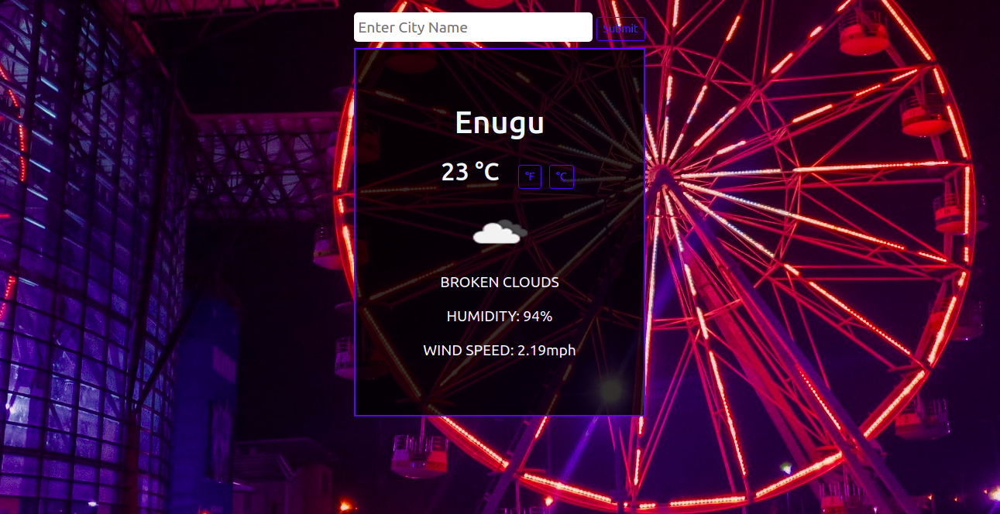

# Ihu Igwe
The Weather App (Ihu Igwe) project comes at the end of the Asynchronous Javascript and APIs section of the Javascript course. It tests the knowledge of the student about asynchronous communication with promises or async/await and when to use them.




## Built With

- Javascript
- CSS
- Webpack

## Live version

You can check the live version in [this link](https://ihuigwe.netlify.app/)

## Getting Started

To get a local copy up and running follow these simple example steps.
On your terminal, run 
```
 git clone git@github.com:Nasa28/Weather_App.git

```


### Usage

- cd into the project

- open the project using code editor of your choice

- Open the `index.html` file with your browser

## Authors

👨‍💻 **Kalu Chinasa Agu**

- Github: [@Nasa28](https://github.com/Nasa28)
-  Twitter: [@Ultimate_Nasa](https://twitter.com/Ultimate_Nasa)
- LinkedIn: [LinkedIn](https://www.linkedin.com/in/kalu-chinasa-agu-a15080103/)


## 🤝 Contributing

Contributions, issues, and feature requests are welcome!

Feel free to check the [issues page](https://github.com/Nasa28/Weather_App/issues).

## Show your support

Give a ⭐️ if you like this project!

## 📝 License

This project is [MIT](LICENSE) licensed.
